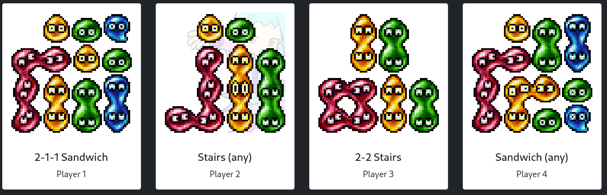

# [Puyo Puyo Chaining Form Roulette](https://doczi-dominik.github.io/puyo-roulette)

A straight-forward *(but specialized)* tool to make Puyo practice/matches more interesting. :)

# Contribution

## Chaining Forms

You can easily add chaining forms:

1. Get a 512x512 image to be used on the cards and put it in `imgs/`.
2. Put an entry in the `forms` array at the top of `index.js`. Use the other entries as examples.
3. Done! The rest will be handled by JS.

## Code

Since web development is not my strong suit and this project was hacked together in a day, the source is likely suboptimal. Every contribution is welcome; I'll continue to refactor it to the best of my ability.
